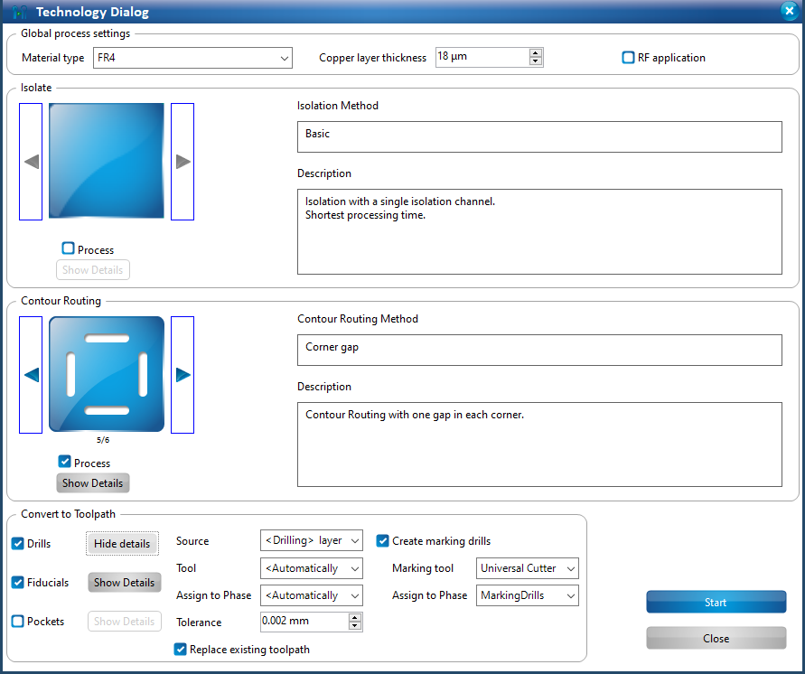
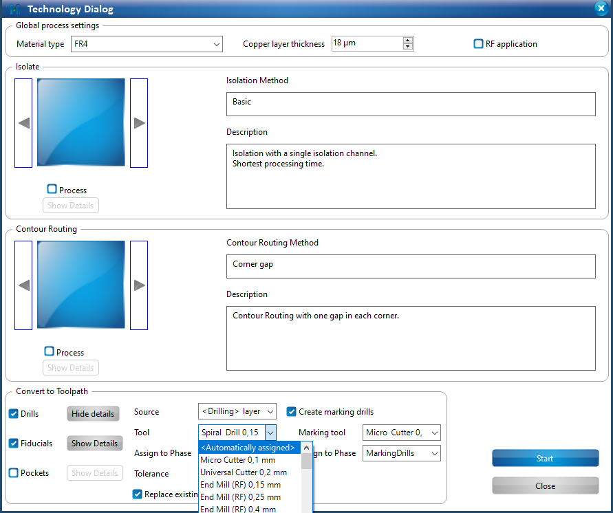
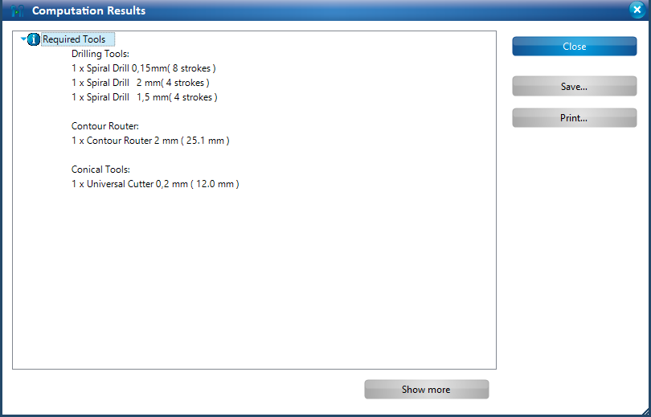

import { Image } from 'astro:assets';
import protomat from '../../../assets/pcb-protomat.jpg';

<Image class="border-2 border-slate-200 rounded-lg" src={protomat} alt="The LPKF ProtoMat S103" width="300" />

The LPKF ProtoMat S103 is a 2.5-dimension CNC mill capable of drilling, milling, and routing to manufacture printed circuit board (PCB) and 2.5-dimension structures on a variety of substrates. The tool is located in the Semi-Clean Room on the 1st floor of the IDC. It is part of the IDC’s PCB fabrication process flow. The tool uses a moving tray and toolhead that allow autonomous movement across the work space with a tool exchange methodology that allows for different mechanical processes to be carried out without user intervention, and a highly-accurate alignment algorithm that enables multi-machine fabrication processes.

Substrates:

- Fiberglass-based or carbon fiber reinforced polymers, including FR4
    - The Hive provides 0.5 oz and 1 oz double-sided copper on 1.55mm FR4.
- PTFE or ceramic-filled base material
- Wood
- Nonferrous materials, such as aluminum or brass
- Plastics such as polyoxymethylen ("Delrin"), or ABS-Copolymere

Tool sizes

- Drill bits between 0.15mm and 3mm
- Contour routing, 1mm or 2mm
- Milling bits between 0.8mm and 3mm
- "Universal" cutting bits, 0.1 or 0.2mm

More details regarding tool structure or usage can be found in the following documents:

The Manual: [ProtoMat S-series Manual (PDF)](/wiki/pcb-protomat-s-manual.pdf)

LPKF's "How-To" guides for some ProtoMat processes, including DXF import, stencils, and pocket milling: [How to do things with the S103 (GDrive folder)](https://drive.google.com/drive/folders/1sDdGPV5wCbAJpt-om1cWms5I-A254zXz?usp=sharing)

The ProtoMat software ("CircuitPro") compendium: [CircuitPro 2.3 Compendium (PDF)](/wiki/pcb-circuitpro-2-3-compendium.pdf)

The vacuum system manual: [Dust Extraction Manual Jet Stream iSeries-e-1-0 (PDF)](/wiki/pcb-dustextraction-manual-jetstream-iseries-e-1-0.pdf)

Our standard operating procedures: [ProtoMat S103 SOP](https://gtvault.sharepoint.com/:w:/s/HiveMakerspace/EcQvNGoNNa5AjiZ5wU1Vd8wBMPNk8mawFspeLrvNaG8VlQ?e=etuWny)

## Q & A

### How do I use the 0.15mm drill bit?

The LPKF sofware handles drill hits down to 0.2mm (7.5 mil) without any adjustments, but we have the capability to make 0.15mm (5.6 mil) drill hits as well with slightly more effort. See our [0.15mm Drill Hits](/wiki/pcb/20-protomat/#guide-making-015-mm-drill-hits) section for details on that.

#### Additional small bit information

The tool is most reliable with drill hits down to 0.4mm (15 mil), which is a pretty standard via size. For smaller bits, you're going to want to be very careful. The bits are quite fragile at this size and prone to breaking when either you or a PI or even the tool is handling them. "The tool?" you think. "Isn't the tool supposed to not break its own bits?" Yes, you would think, but at that scale, it still happens. It happens most frequently when the tool is adjusting the bit's height in the toolhead (right after it's picked the bit up), or during a drill hit.

Therefore, it's really important to actually watch the bit exchange and then all of the drill hits to be able to emergency stop the tool (lift the cover) if it does break. Otherwise, the tool will not drill your holes out all the way. You can always replace the bit and re-drill if this happens, but it's still a pain. Either way, strongly consider if you need holes that small! Anything to make this process more reliable will save you lots of headaches and heartaches.

## Common processing errors

### Software cannot/did not connect to the tool

First, make sure the ProtoMat hardware is on; if it's on already, there will be a red light under the toolhead (for the camera), and the status light on the toolhead should be at least blinking green. If it's not on, turn it on by toggling the green switch located underneath the cover, to the right of the working table, above the main power cable. Once you've confirmed the hardware is on, in the software, in the main toolbar (with the File menu), click "Machining" > "Connect". Make sure that "S103" is selected in the dropdown menu and click "Connect". Let the connection process happen, and then try the fabrication again.

### My gerber/drill file didn’t show up on the CAM view.

You probably forgot to assign it a layer. If this happens, the software will put the gerbers onto their own layers that are named with the gerber's name. Try re-importing the files, and make sure you’ve assigned each file a Layer/Template (see figure 11). Also make sure to delete the incorrectly-generated layers (right-click and select "Delete").

### The tool didn't drill out my holes!

You likely forgot to import the drill file. You'll have to restart the project over again. Sorry.

### The tool exchange was botched!

Stop the process as soon as possible, if it's still running. Go get a PI. If they don't know what to do, ask them to message our Slack channel.

### The drill hits are incorrect, or the routing path was wrong!

There are a couple of possible reasons for this.

1. You may not have imported the drill file or the board outline gerber correctly.
2. The bits in the magazine may have been incorrect.
3. The tool may have done something silly.

In any of these cases, there is no good solution other than to restart the project and double check all of these (if possible) before starting to re-process. Sorry.

### I can't change the layer/template option in the Import step!

Sometimes, for reasons unclear, a Gerber file gets automatically assigned to a undesired layer in the LPKF software on the ProtoMat, and cannot be changed. If this happens, what you need to do is highlight all the polygons on that layer in question that were imported, and move them to the correct layer (right click > Move to Layer). Highlighting a whole layer requires playing with the Layers pane on the left, and then click-and-drag across all the polygons. If there are things on that layer that are supposed to be there (e.g. you need to move only some of the polygons off the TopLayer layer), it can be worth just starting the process again, and importing the messed up Gerber first.

Details of this process can be found in this [short video](https://gtvault.sharepoint.com/:v:/s/HiveMakerspace/ERXPg3zNYL1Fn06aSnZUpy8BwKb8Zc7c-AamOw3U4H3wyA?e=k2br2n).

## Guide: Making 0.15-mm Drill Hits

import { Steps } from '@astrojs/starlight/components';

You've reached the 0.15mm Drill Hits page! That probably means that you wants the down-low on drilling those super-duper tiny holes.

The first thing to know is that tiny bits are really, really, really tiny. So tiny that they frequently break, sometimes even during a run. So it's important to be watching the whole time the tool is using them to be able to stop it (usually by lifting the cover) if it does break, and get a PI to remove and replace the bit. You'll then have to restart the process from the step you stopped at with the fresh bit. Don't blink!

Unfortunately, the software isn't clever enough to handle this bit because it's smaller than the default drill marker (which is 0.2mm), so we have to do of manual work to force it into using that bit. Not hard, just a few steps:

<Steps>
1. Setup your process, import your files, and add your fiducials, all as you would normally.
2. Open the toolpath generation window (the fourth button, called "Toolpath Dialog") 
3. In the bottom section ("Convert to Toolpath"), next to "Drills", click "Show Details" 
4. For "Tool", select "Spiral Drill 0.15mm". 
5. For "Marking tool", select "Micro Cutter 0.1mm". 
6. Start the toolpath generation (click "Start"). You should get a result that looks like the below image; each hole in your design will be assigned the 0.15mm spiral drill. 
7. Now go back into the Technology Dialog window. Change the "Tool" to "\<Automatically assigned\>" and the "Marking tool" to "Universal Cutter 0.2mm". Make sure "Replace existing toolpath" is checked before running the algorithm again (click "Start").  
8. The results should now be adjusted correctly for the other drills, with the correct number of 0.15mm drill hits as well. 

</Steps>

When you save it after the correct toolpath generation, it will save with the 0.15mm drill hits. However, you'll have to do this every time you generate a toolpath with 0.15mm drill hits.

Good luck!
