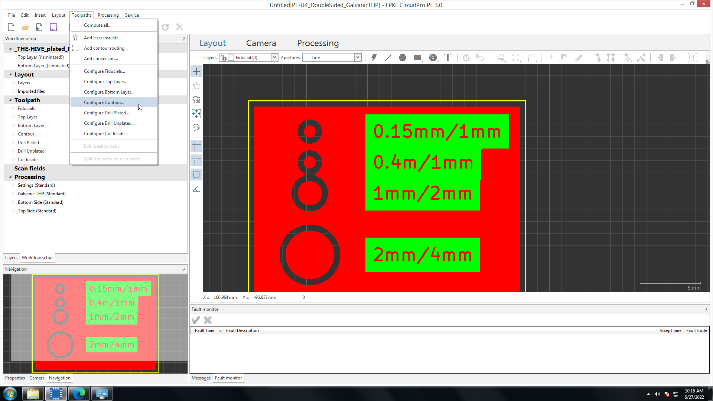
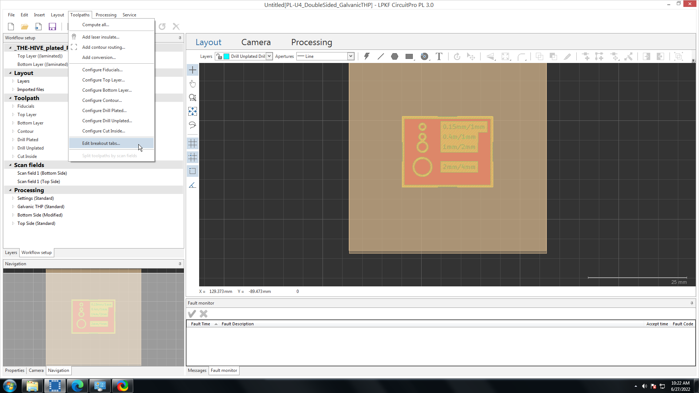

import { Image } from 'astro:assets';
import protolaser from '../../../assets/pcb-protolaser.png';

<Image class="border-2 border-slate-200 rounded-lg" src={protolaser} alt="The LPKF ProtoLaser U4" height="300" />

The LPKF ProtoLaser U4 is an automated laser etching and micro-machining tool. It uses a pulsed 5.7W 355 nm class 1 laser to reduce thermal effects on the substrate, and a laser spot size of 20 um allows for etching of structures down to a theoretical limit of 65 um (~2.55 mil). This combination allows for a very wide range of processing substrates and films, but it is particularly good for thinner substrates that the more physically-taxing ProtoMat may damage, organic/flexible substrates, and for very precise RF etching.

An incomplete list of compatible substrates and films:

- Metal layers of all sorts, including copper, gold, and aluminum
- Laminated substrates, e.g. FR4
- Ceramics, including fired, low-temperature cofired (LTCC), metal oxides, and more
- Flexible substrates, including semi- and selectively-flexible substrates
- Soldermask
- Photoresist
- Glass/oxide, especially with invisible conductive (TCO/ITO) layers
- Any material combination for which the absorption characteristics of the substrate and structuring layer (film) are different

Some theoretical specifications:

| Spec | Theoretical value |
|---|---|
| Laser pulse frequency | 25 kHz–300 kHz |
| Structuring speed | 200 mm/s (7.8"/s) on 18 µm/½ oz Cu on FR4 |
| Cutting speed | 200 mm/s (7.8"/s) 0.5 mm (0.02") FR4 |
| Diameter of focused laser beam  | 20 ± 2 µm |
| Minimum line/space | 50 μm/20 μm (2 mil/0.8 mil), on laminated subtrate (18 µm Cu) |
| Accuracy | ±1.98 µm (± 0.08 mil) |
| Positioning accuracy | ± 20 μm |
| Repeatability | ± 2 μm |
| Resolution | 1.2 um |

For more information, see the following documents:

The brochure: [The Swiss Army Knife for the Lab: Micro Material Processing with the LPKF ProtoLaser U4](https://www.lpkf.com/fileadmin/mediafiles/user_upload/products/pdf/DQ/brochure_lpkf_protolaser_u4_en.pdf)

The Manual: [ProtoLaser U4 User Manual (PDF)](/wiki/pcb-protolaser-u4-usermanual.pdf)

LPKF's "How-To" guides: [ProtoLaser U4 How To Guides (PDF)](/wiki/pcb-protolaser-u4-howto.pdf)

Software guide: [CircuitPro 3.0 PL - Software Guide (PDF)](/wiki/pcb-circuitpro-3-0-pl-softwareguide.pdf)

Vacuum system manual: [Dust Extraction Manual CSA 600 iSeries-e-1-0 (PDF)](/wiki/pcb-dustextraction-manual-csa600-iseries-e-1-0.pdf)

Optimizing your process: [Protolaser - Optimization (PDF)](/wiki/pcb-protolaser-optimization.pdf)

## Q & A

### What materials have been used successfully?

This is a running list of materials that we, or someone we know of, have successfully etched and/or cut. *(Last updated: 2022-06-22)*

- 0.5oz (18um)/1oz (35um) copper on FR4
- 5mil/0.125mm polyamide
- Polyester (PET) (1mil and 2mil) [Kapton settings]
- Rogers TMM 10i

#### Using a "new" material

So you have a material that either isn't in the laser's material list, or maybe you just want to play around with the settings. Exciting! Head over to our [ProtoLaser: New Material](https://gtvault.sharepoint.com/:w:/s/HiveMakerspace/EShrwNPAMH1Cj3cE3pg5h8QB6r3JP-XtLghmQcU96-fNfA?e=Ska4Ud) document for how to do this. You can also see below for optimizing this process.

### Optimization

The ProtoLaser can be a very powerful tool. If you're working carefully with it, and you want to know more details about how the tool works, and how to better optimize your process, please see LPKF's [Protolaser - Optimization (PDF)](/wiki/pcb-protolaser-optimization.pdf) document. This has proven to be useful for some users in the past. You can also contact LPKF directly at [lasersupport@lpkfusa.com](mailto:lasersupport@lpkfusa.com). A quick breakdown of optimizing is to look at the etch under a microscope with a set of tweezers in hand. Try to lift one of the stuck-on strips with the tweezers. If the ends of the strip are stuck, adjust the Mark Speed of the "Contour" tool down by 10%. If the sides are stuck, adjust the Mark Speed of the "Hatch" tool down by 10%. If the entire strip is stuck, adjust the Mark Speed of the "Heat" tool down by 10%. Repeat this until the etch is better for you.

Adjusting the breakout tabs If you're running a single-sided laser-only process, you can adjust the breakout tabs that connect the board to the substrate, both their position and size. See "[Adjusting Breakout Tabs on the Laser](/wiki/pcb/21-protolaser/#guide-how-to-adjust-the-breakout-tabs-on-the-laser)" for details.

## Common processing errors

### The pre-toolpath file did not import correctly.

It’s likely that you either did not save at the correct point in the process, you saved over the pre-toolpath file, or you are trying to import the wrong file. Double check all of this. If you’re certain you did it correctly, get a PI.

### The fiducials did not move/moved incorrectly when I moved the design during "Placement".

Sometimes, when placing the board, the fiducials move in the opposite direction as the board. This is a known bug! You can either: try estimating the location of the fiducials and starting the process; start a new document; restart the software; or restart the hardware. (The latter two require a fresh 20 minute warmup for optimal performance.)

### The bottom/top didn’t etch completely.

You can either restart the process entirely (hit the Play button, see figure 32) or right click on "Top Side" (or "Bottom side") under "Processing" on the left, and click "Process from here" to restart the top (or bottom) side processing with top (or bottom) side alignment. You can also do this for an individual tool or an individual tool for a single scan field through the "Scan Fields" drop-down in the same area.

A more involved, but better long-term, solution is to make your own material settings: [ProtoLaser: New Material](https://gtvault.sharepoint.com/:w:/s/HiveMakerspace/EShrwNPAMH1Cj3cE3pg5h8QB6r3JP-XtLghmQcU96-fNfA?e=Ska4Ud). It's not hard to do, though adjusting the settings can be time consuming. A quick thing to do it to look at the etch under a microscope with a set of tweezers in hand. Try to lift one of the stuck-on strips with the tweezers. If the ends of the strip are stuck, adjust the Mark Speed of the "Contour" tool down by 10%. If the sides are stuck, adjust the Mark Speed of the "Hatch" tool down by 10%. If the entire strip is stuck, adjust the Mark Speed of the "Heat" tool down by 10%. Repeat this until the etch is better for you. See LPKF's [Protolaser - Optimization (PDF)](/wiki/pcb-protolaser-optimization.pdf) document for more details on this process. ***DO NOT ADJUST THE DEFAULT MATERIALS!!*** Only adjust a custom material that you've created.

### The board is/is not flipped in the Processing tab.

On the left of the screen, make sure nothing is selected under "Processing". If there is, hold down either CTRL (on Windows) or the command key (on Mac) and then left click to de-select it. If that doesn’t fix it, you can select either "Bottom Side" or "Top Side" (again, on the left) to force the correct orientation. You can try starting the project over again if this doesn’t solve it as well. Sometimes, the software has bugs.

### The toolpath generates drilling or cutting operations.

Usually, this happens because the "supported by ProtoMat" box was not checked when you selected the template. Because the ProtoLaser does not know that you are using the ProtoMat for drilling and contour routing, it will try to do it itself. Reselect the template, making sure this box is checked.

### The software throws and "Insufficient pressure" error.

**Potential issue**: The vacuum hose may be disconnected from the extraction hood.
- Lift the door. The extraction hood is the plastic bit that the laser comes out of. There is a hose that should run from that to the back of the machine (still all inside the main bay). Make sure that its snugly inserted on both ends.

**Potential issue**: The vacuum system may not be on or working strongly enough.
- Confirm that the vacuum system is on.The vacuum system is the tall white box to the tool’s right. On the front panel, at the bottom, there should be some buttons. Try increasing the suction pressure.

**Potential issue**: The vacuum hose(s) may be clogged.
- There are two vacuum hoses. One runs from the extraction hood (the round plastic bit inside the main bay) to the rear interior wall of the tool, and the second runs from the outside backside of the tool to the vacuum system (the tall white box to the tool’s right). You should be able to remove both of these and check for clogs.

**Potential issue**: If your substrate is very small, not enough of the bed may be covered for proper vacuum pressure.
- Tape down an old piece of 8"x12" FR4 on the bed. Then, secure your sample inside one of the cutouts. If the FR4 has a lot of holes, try covering some of them with tape.

## Guide: How to adjust the breakout tabs on the laser

{/* TODO: Add steps, use starlight steps component */}

So you're running a [single-sided laser-only process](/wiki/pcb/11-pcb-processes#single-sided-no-holes), and you'd like to adjust the breakout tabs. No problem! It's very straightforward to do, and you can do it before or after the toolpath has been generated.

Before we start, it's useful to recognize that the software has some silly and sort of confusing nomenclature: "Contour routing" is the cutting out of the board, and is done using the "CutOutside" tool. The "Contour" tool is completely unrelated to this; this tool isolates regions that need to retain copper from those that need to copper removed. Don't confuse them in the Toolpath Generation window!

You can adjust the type of breakout tab alignment (two, four, corners, sides, equidistant) and the thickness by going into the "Configure Contour Routing" window under the "Toolpaths" menu to bring up the "Laser contour routing" window:  

Feel free in this window to adjust pretty much whatever you'd like to. "Method" is how many and where the breakout tabs will exist. "Position" is whether the routing will happen on the inside of the defined zero-width board edge line, or the outside (outside is the default). "Source" is the layer that defines what this routing process will affect; you can add different routing processes by going to "Add Contour Routing" under the "Toolpaths" menu. "Channel width" is the thickness of the rout, i.e. the distance between the board's actual cut edge and the substrate's cut edge. And "Gap width" is the length of the tabs themselves, which can also be adjusted in the "Edit Breakout Tabs" window. I don't really know how "Laser overlap" affects things. "Tab positions" is the same as "Method".

You can adjust the size and position of the breakout tabs individually through the "Edit Breakout Tabs" window (under the "Toolpaths" menu)  

I didn't touch the "Algorithm", but "Gap width" is the length of the tabs themselves, and you can specify the break positions of each tab by clicking "Add tab" to add the number of tabs you'd like explicitly. "Gap width" will affect all the tabs equally. Checking "Replace existing toolpath" will do just that - it will replace any previously made tabs and settings with these new ones.
