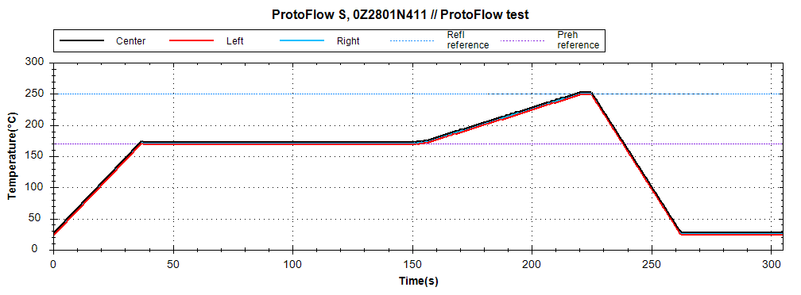
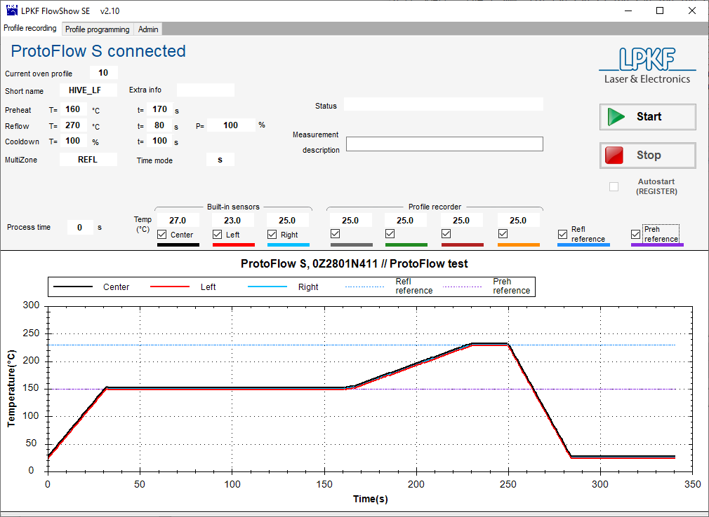
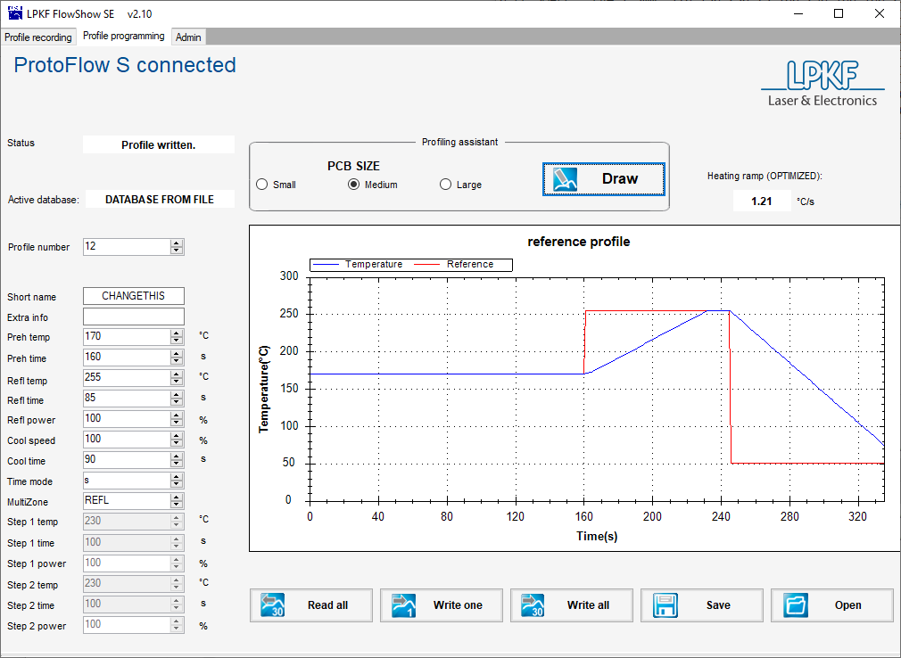
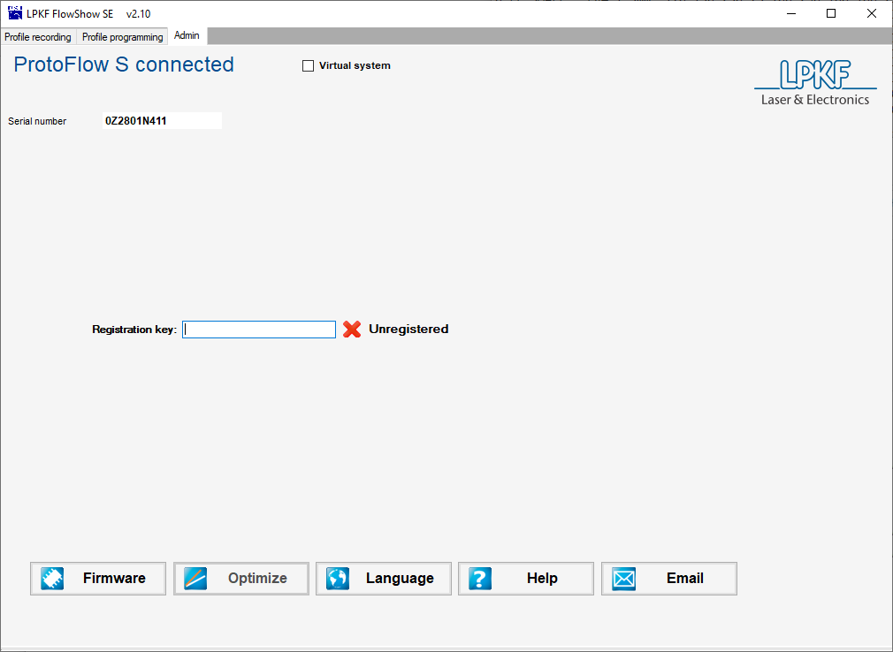

import { Image } from 'astro:assets';
import { Steps } from '@astrojs/starlight/components';

## How to make (and use!) stencils

### What is a stencil?

A *stencil* is a material with cutouts that enables solderpaste to be more easily and precisely applied prior to component placement and reflow. (If you don't know what I mean by 'reflow', or want more information about that process, see our "[Reflow Oven](/pcb/31-stencilnreflow#how-to-use-the-reflow-oven)" page for more.) Stencils can be made with a variety of materials; the images below show two very common ones: polyimide and stainless steel on the right. Kapton tape (also polyimide) is another low-cost option. The Hive has 5mil polyimide sheets for stencil fabrication that are free for users, as well as Kapton tape. We also have (courtesy of Stephan Strassle) recipes for using [PET projector transparency sheets](https://www.amazon.com/dp/B087BF4YLJ) between 0.5 and 10 mil thick.

Stencils are by no means a required or necessary step for completing your PCB. They are very useful if you have many surface-mounted components (SMDs), SMDs with many pins or fine-pitch pins, or have a few SMDs but many identical boards. *They do not work for through-hole components!* Those must be done by hand.

import ex1 from '../../../assets/guide-stencil1.png';
import ex2 from '../../../assets/guide-stencil2.jpg';

<figure>
    

        <Image class="inline-block border-2 border-slate-200 rounded-lg" src={ex1} alt="Polyamide stencil" height="200" />

        <Image class="inline-block border-2 border-slate-200 rounded-lg" src={ex2} alt="Stainless steel stencil" height="200" />
    

    <figcaption>Two very common types of stencils: polyimide (left) and stainless steel (right) — [Image source](https://www.autodesk.com/products/fusion-360/blog/getting-started-solder-paste-stencils/)</figcaption>
</figure>

### How to make a stencil

Stencils can be fabricated at The Hive using the LPKF ProtoLaser U4. The process detailed here is for ***5 mil/0.125mm polyimide ONLY***. The Hive provides this material free of charge to our users. For other accepted materials, you'll have to adapt the process below. **Stainless steel is not allowed in the ProtoLaser!!** If you require a stainless steel stencil, please email us ([hive-pcb@ece.gatech.edu](mailto:hive-pcb@ece.gatech.edu)).

**NOTE**: If you're using the PET sheets ([Amazon link](https://www.amazon.com/dp/B087BF4YLJ)), the material settings should be labeled `PET_<thickness>um` (there might be an "ss" in there somewhere as well, for the creator) for whatever thickness in um (microns, NOT mils) you're using. The process below will be the same other that the material settings selection.

*(If you have never used the ProtoLaser before, you'll need to be trained prior to use; see [this page](/guides/pcb-training/) for details on that. Stencils made of non-metallic materials, like polyimide, can also be made with our laser cutters, but that's beyond the scope of this write-up.)*

**Note**: This process is detailed in the LPKF ProtoLaser's "How-to" document, which can be found both [here (PDF)](/pcb-protolaser-u4-howto.pdf), and on the ProtoLaser itself (in the "ProtoLaser Docs" folder on the Desktop). See section 4.1, p. 120.

Before you start, you'll want to make sure that you have your solderpaste gerber files ready, along with your piece of polyimide. Note that we (typically) have either full 8×12 sheets, or a 24"-wide roll. If you need a full sheet, use one. Otherwise, use scissors to cut an appropriately-sized piece from the roll, making sure to leave enough room for a sizeable (~1 inch) frame/boarder around the design. Cut a large enough sheet for ALL stencils you'll be making (one per side of the PCB, if you have components on both sides - check your solderpaste gerber files).

<Steps>
1. Log into the ProtoLaser. Turn on the tool and/or start the software if they are not already on and running. Brush off the processing surface; it needs to be clear of debris so that the polyimide can sit flat. Place your polyimide sheet onto the processing table and tape it down.
    1. It's advisable to tape it down as snug as possible. Unlike FR4, this will flap around during processing if it's not secured to the table. Taping all four edges works well.
2. Start a new project ("File" > "New").
3. The template is called "THE-HIVE_Stencil" or something similar. It should be in the templates list at the top under "Custom Templates", but if it is not, click "Browse" (lower left) and navigate to "Documents". The stencil file should be there.
4. "File" > "Import", and select a solderpaste gerber file.
    1. Note that you need one stencil per side of the board, so only select a single gerber file. Put the Gerber onto the SolderPasteTop layer even if the gerber should be for the bottom solder paste, before clicking "OK".
    2. Stencils don't have a side because they get cut through, so by adding all the Gerbers to the same layer (i.e. SolderPasteTop), it will etch them all at once.
    3. If you see a warning about nothing on a copper layer, just click "Continue".
5. If you have multiple solderpaste gerbers to import (i.e. multiple stencils to make, e.g. a PCB with components on both sides, or multiple PCBs), move your design out of the way (select all, right click, "Move Object"), and then repeat the previous step (the import step).
    1. After importing all your designs, move them around (left-click-and-drag to select them individually, right click, "Move Object") to position them as you'd like them to be cut.
6. "Toolpaths" > "Computer All" to compute the toolpath.
    1. If it has anything other than "Contour", you've likely selected the wrong template, so go back to the start of this tutorial. Otherwise, shoot us an email.
    2. Click "Close" when completed.
7. Move to the "Processing" tab to position your design on the polyimide sheet.
    1. Turn on the pilot laser (black laser button in the toolbar).
    2. Double-click on the processing area to move the pilot laser. Position it where you'd like the top-right of the design to sit on the polyimide sheet. Note that you want at least 1" of space between the edge of the sheet at the processed design.
    3. Right click > "Placement", and then left-click-and-drag to move the design. Align the design with where you've placed the pilot laser.
    4. Move the pilot laser (double-click) to the corners of your design to confirm that the >= 1" boarder exists for all four edges. If not, you will have to either move the design again (with the "Placement" window open), or you may have to cut a larger sheet of polyimide if you mis-judged.
8. Once the design is properly placed within the polyimide, press the green play button in the toolbar (or "Processing" > "Process All" in the main toolbar) to begin processing. Follow the steps as requested.
9. After processing, you may need to bend the stencil a bit to make sure all the little bits are out. Check with the jeweler's glass in the "PCB Tools" drawer to confirm if you can't visually confirm.
</Steps>

### How to use a stencil

Once the stencil is fabricated, it must be aligned with the bare board underneath. The stencil should sit against the board **as flat as possible**! This is very important for applying the correct amount of paste, as well as not pushing paste underneath the stencil (rather than through the cutouts). Because the stencil is often cut out of a sheet of material larger than the PCB itself, often some unused PCB material of the same thickness (scraps or fresh, whatever you have) is used to surround the PCB and provide support to the stencil (see image below left). Make sure to secure everything down so it doesn't move! Typically tape is used for this, but The Hive also has a fancy frame system that you can use (the [LPKF ProtoPrint S](https://www.lpkfusa.com/datasheets/prototyping/zelprint.pdf)).

Apply paste over the stencil using whatever tool you have, either a syringe, a wooden spatula/tongue depressor, whatever. You don't need a lot, so start with less than you think you need. (**NOTE!!** The reflow oven that The Hive has is optimized for **lead-free** solder paste, so if you're planning on using our oven, please make sure to use lead-free paste, or you'll be sad later.)

Then use a squeegee of some sort (credit card, ID, plastic scraper) to squeegee the applied paste across the stencil and into the cutouts (see image on right). You shouldn't need to press down very hard, and again, maintain the stencil as flat against the board as possible.

import ex3 from '../../../assets/guide-stencil3.jpg';
import ex4 from '../../../assets/guide-stencil4.jpeg';

<figure>
    

        <Image class="inline-block border-2 border-slate-200 rounded-lg" src={ex3} alt="Stencil supports" height="200" />

        <Image class="inline-block border-2 border-slate-200 rounded-lg" src={ex4} alt="Stencil paste application" height="200" />
    

    <figcaption>To lay the stencil flat against the PCB, you may use scrap material for support (left); use a scraper tool to spread the paste over the stencil (right) — Image sources [1](https://www.sparkfun.com/tutorials/58), [2](https://www.pcbway.com/blog/PCB_Design_Tutorial/A_very_easy_way_to_accurately_align_the_stencil_with_the_PCB_1.html)</figcaption>
</figure>

You can always lift the stencil to check your progress, but you run the risk of ruining the alignment, so be careful.

Once the squeegee'ing is done, lift off the stencil and confirm paste is where you expect and not where you don't. If you got some excess outside where you wanted, that's okay, just scrape it off (because solderpaste is expensive, so we'll want to re-use as much as possible), then clean the PCB of any remainder, and try again.

**NOTE!!** The human eye is very good at detecting mismatched edges! However, this process is surprisingly tolerant, especially with regular-pitch components. Try not to be too picky. You can also always reflow again, or cut traces later if needed. It's a bit of trial and error to get a feel for this.

One other thing to note about this process is that it's extremely likely that it will look like the pads are shorted together, i.e. the paste will connect across pads. This is typically okay! When the paste melts, it will naturally wick to the nearby copper, which is hotter than the soldermask and/or the bare FR4. **BE AWARE!!** If you have a bare board, i.e. without soldermask, it's critical to etch copper away from between the pads, or you ***will*** get shorted pads later. This must be done prior to board fabrication. (Soldermasking can be attempted with Kapton tape, but YMMV and it's a very unsupported process. See [this page](/pcb/30-masknsilkscreen/#soldermasking-with-kapton-tape) for how you can try that.)

After the paste is applied to your satisfaction, move your board and all the components for placement to near where the reflow will happen (either a bench with a reflow station if you're a masochist, or near the reflow oven in the semi-clean room). You want to do the actual placement of components near to where the reflow will happen because the less you need to move the board with all your non-soldered-on components, the better. Using tweezers (we have plenty upstairs), place each component onto the PCB in the proper position. Double check the component and *orientation* prior to placement! You'll be sad later if you discover you put a key IC on backwards and fried it. Pin 1 is often indicated with a dot.

Once you've placed all your components, you can reflow the board to melt all the solder in place at once. See our "[How to reflow](/pcb/31-stencilnreflow#how-to-use-the-reflow-oven)" page for how to use the reflow oven.

## How to use the reflow oven

### What is a reflow oven?

A reflow oven is a specially-designed temperature-controlled box with air circulation that is used for melting solder paste. In layman's terms, it's a precision oven that you don't put food into. The heating and cooling follow a relatively precise profile to melt the solder without causing too much thermal stress to the substrate and the components. The solder used here is actually *solder paste*, rather than standard solder wire, which is solder that's suspended in a flux paste. You apply this to the pads (typically using a [stencil](/pcb/31-stencilnreflow#how-to-make-and-use-stencils)), place your components onto the board, and then put the board into the oven, which melts the solder paste and electrically adheres the components to the board.

### How to use the reflow oven (Basics)

The Hive's reflow oven, the [LPKF ProtoFlow S N2](https://www.lpkfusa.com/datasheets/prototyping/protoflow.pdf), is located in the Semi-Clean room on the lower level of the IDC in Van Leer. It looks like a large rectangular box in the far corner of the room. It's connected to a computer that can theoretically provide higher-precision information and control over the oven, but that's beyond the scope of this writeup. Feel free to experiment if you'd like.

The oven has a power button on the front of the tool, and a small screen with four arrow keys on the top. That's it.

There is no training required to use the oven.

To operate (images below):

<Steps>
1. Apply solder paste to the pads of your board (usually with a stencil) and populate your board with all surface-mount components. Leave off components that cannot be reflowed, e.g. connectors. Check all datasheets if you’re unsure! Default lead-free profile reaches 270C, leaded reaches 230C.
2. Power on the oven by pressing the power button on the front of the tool.
3. Using the arrow keys and the screen, navigate to the profile you'd like to run.
    1. If you used lead-free solder paste, select "HIVE_LF". (Temperature profile given below.)
    2. If you used a leaded solder paste, select "HIVE_PB". (Temperature profile given below.)
4. Press the right arrow key to select the profile, the up-arrow key to highlight "OPEN/CLOSE", and the right arrow key to open the drawer.
5. Once the drawer is open, adjust the metal bars inside (they're magnetic) to be the correct spacing so that your PCB sits on their edges safely. Remove your PCB and press the right arrow key to close the drawer.
6. Navigate to "START PROF" (down arrow key), and then start the profile with the right arrow key.
7. Once the oven has warmed up (a minute or two), the drawer will open. Place your PCB onto the pre-aligned bars. BE CAREFUL – they're hot! Press the right arrow key to close the drawer.
</Steps>

The profile will run. When it's completed, the drawer will open. Carefully remove your PCB (it's hot!), and press enter to shut the drawer.

import protoflow from '../../../assets/pcb-reflow.png';

<figure>
    <Image class="inline-block border-2 border-slate-200 rounded-lg" src={protoflow} alt="LPKF ProtoFlow S N2" height="300" />
    <figcaption>**Clockwise from top-left**: the oven with its computer; the drawer open with the magnetic metal bars and green thermistor wires; the front of the oven with the power button prominently featured; and the screen and the four arrow keys on top of the oven. </figcaption>
</figure>

**Lead-free solder paste oven temperature profile**

**Leaded solder paste oven temperature profile**

### Advanced reflow use (i.e. using the software)

{/* TODO: Add steps, use starlight steps component */}

The reflow oven is a pretty simple tool, especially if you're using the standard recipes. However, the software allows additional functionalities to be taken advantage of. The software is called **FlowShow**, and can be launched from the main taskbar on the desktop to the right of the oven. The computer should be on, so just press the monitor's power button (lower left of the screen); if the computer is off, you can power it on and it should automatically log in. The manual for the software is in the bookmarks bar of the Edge browser.

There are three tabs of operations. The main tab, "Profile recording", allows the user to monitor the temperature during tool use, and to record the temperature profile. **NOTE** that the "Start" button only starts the recording, *not* the process! Similarly, the "Stop" button does not stop the process, only the recording. There are seven temperature sensors in the tool: three are built-in, but four, the "Profile recorder" ones, are thermocouples that can be positioned as desired within the oven itself, and can be useful for precision reflow processes where the temperature across the board is critical, or for sensitive components. These four can be found either within the main oven drawer (the green wires; see image above), or disconnected and sitting next to the tool. Be careful not to pull them too hard. Kapton tape is effective at keeping them in place over the duration of a process. It's recommended that you position and attach them to your board prior to placing it into the tool (i.e. have them disconnected and outside the tool, tape the ends down onto your board, place the board into the tool carefully at the assigned time, plug the thermocouples in inside the front door near the floor of the tool, and then close the door to start the process).

The middle tab, "Profile programming", is where custom profiles may be created. **ONLY ADJUST PROFILES 12 ("CHANGETHIS") AND ABOVE (USER01 - USER17)!!** Please do not mess with the other profiles at this time. Adjusting the profile is as easy as changing the numbers and times around, but if you do this without careful consideration sand knowledge, you can seriously damage or ruin your board and components outright.

Reflow can typically be separated into three stages: preheating, reflow, and cool-down. The machine has a built-in "optimized" heating ramp up that's given in the upper-right corner of the software. It's generally a good idea to follow this unless your process requires more rapid heating or cooling. Preheating brings the board and components and solder paste to a uniform temperature, and usually involves a soak at that temperature to ensure uniformity. The reflow is when the temperature is brought above the solder's liquidus point, where it transforms into a liquid. Most components don't like being that hot, so the amount of time at those high temperatures should be limited. Finally, there's a cool-down back to "ambient" temperature. Cooling-down too rapidly can also damage the board due to thermal shocks, so it's a good idea to leave this as is as well.

The "Profiling assistant", seen right above the plot, can be used to see how your profile compares to the "standard" profile. Simply click on your board size (small is around 5-10 sq. in., medium is up to 25 sq. in., large is bigger than that) and click "Draw" to see the estimated profile.

Once you have adjusted the parameters to your liking, press "Write One" to save and load it onto the machine. It should load as the current profile as well. Then you can run it as normal.

**Write down the parameters as you set them for later!** Someone else may come and write over yours later.

The third tab, "Admin", has no useful options except for the "Virtual Mode" checkbox at the top. This allows you to test different profiles without actually running the tool. This was useful for me to make the profiles above, but frankly, I'm not sure when it may be useful to anyone else.
